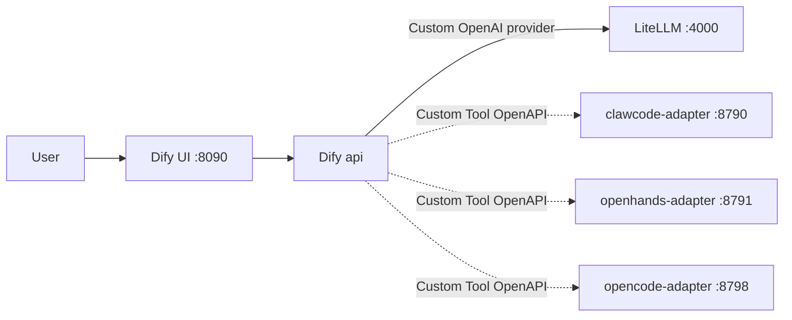
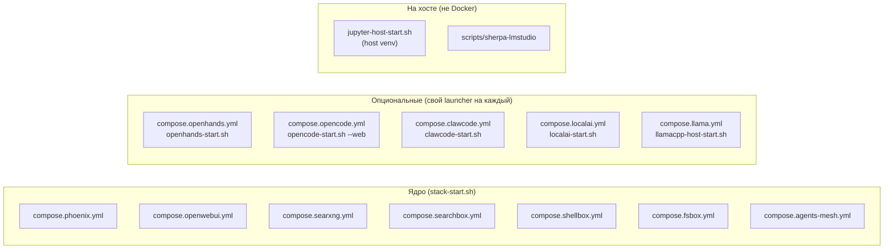

# INSTALL.md — установка lego-claw и карта всех тумблеров

> Этот документ дополняет [`README.md`](README.md): здесь подробная
> установка от чистой ОС до работающего стека и **карта на все
> "включить / выключить"**: какой кубик чем поднимается, чем гасится,
> и где менять модели, порты, провайдеры.

---

## Оглавление

1. [Системные требования](#1-системные-требования)
2. [Установка зависимостей](#2-установка-зависимостей)
3. [Клонирование репо и первая настройка](#3-клонирование-репо-и-первая-настройка)
4. [Первый запуск](#4-первый-запуск)
5. [Карта тумблеров: что чем включается/выключается](#5-карта-тумблеров)
6. [Как поменять модель](#6-как-поменять-модель)
7. [Как поменять порты](#7-как-поменять-порты)
8. [Обновление](#8-обновление)
9. [Полная остановка / удаление](#9-полная-остановка--удаление)
10. [Если что-то сломалось](#10-если-что-то-сломалось)

---

## 1. Системные требования

| Категория | Минимум | Рекомендуется |
| --- | --- | --- |
| ОС | Linux x86_64 / ARM64 (Debian 12+, Ubuntu 22.04+, Fedora 39+) | Debian / Ubuntu LTS |
| CPU | 4 ядра | 8+ ядер |
| RAM | 16 GB (без локальных моделей) | 32+ GB |
| Диск | 50 GB (репо + docker images) | 200+ GB SSD |
| GPU | не обязательно | NVIDIA с ≥ 8 GB VRAM (для LocalAI/llama.cpp/vLLM) |
| Docker | ≥ 24.0 + Compose v2 | актуальная |
| Python | ≥ 3.12 (только для host-side Jupyter / sherpa-моста) | 3.12 |

Тестировалось на: NVIDIA DGX Spark (GB10, aarch64), Debian 12.

---

## 2. Установка зависимостей

### Debian / Ubuntu

```bash
# Docker + Compose
sudo apt update
sudo apt install -y ca-certificates curl gnupg lsb-release
curl -fsSL https://download.docker.com/linux/ubuntu/gpg \
    | sudo gpg --dearmor -o /etc/apt/keyrings/docker.gpg
echo "deb [signed-by=/etc/apt/keyrings/docker.gpg] \
    https://download.docker.com/linux/$(lsb_release -si | tr A-Z a-z) \
    $(lsb_release -cs) stable" \
    | sudo tee /etc/apt/sources.list.d/docker.list
sudo apt update
sudo apt install -y docker-ce docker-ce-cli containerd.io \
    docker-buildx-plugin docker-compose-plugin
sudo usermod -aG docker $USER     # перезайдите в shell после этого
newgrp docker                      # или это, чтобы не разлогиниваться

# Полезное
sudo apt install -y ripgrep jq curl openssl python3-venv git
```

### NVIDIA GPU (опционально, для LocalAI / llama.cpp / vLLM)

```bash
# nvidia-container-toolkit (см. https://docs.nvidia.com/datacenter/cloud-native/container-toolkit/)
distribution=$(. /etc/os-release; echo $ID$VERSION_ID)
curl -s -L https://nvidia.github.io/libnvidia-container/gpgkey \
    | sudo gpg --dearmor -o /usr/share/keyrings/nvidia-container-toolkit-keyring.gpg
curl -s -L https://nvidia.github.io/libnvidia-container/$distribution/libnvidia-container.list \
    | sed 's#deb https://#deb [signed-by=/usr/share/keyrings/nvidia-container-toolkit-keyring.gpg] https://#g' \
    | sudo tee /etc/apt/sources.list.d/nvidia-container-toolkit.list
sudo apt update
sudo apt install -y nvidia-container-toolkit
sudo nvidia-ctk runtime configure --runtime=docker
sudo systemctl restart docker
# проверка
docker run --rm --gpus all nvidia/cuda:12.4.0-base-ubuntu22.04 nvidia-smi
```

### LM Studio (опционально)

Только если хотите подкидывать в LiteLLM локально-запущенные GGUF
через LM Studio API. Скачать: <https://lmstudio.ai/>. После старта
держите включённым `Settings → Developer → Local LLM Service` на
`:1234`.

---

## 3. Клонирование репо и первая настройка

```bash
git clone https://github.com/Ichigec/lego-claw.git
cd lego-claw

# Скопировать все шаблоны .env в рабочие файлы (.env* в .gitignore)
for f in .env*.example; do
    cp "$f" "${f%.example}"
done

# (Опционально) Глянуть какие порты/паттерны
grep -hE "^[A-Z_]+_HOST_PORT=" .env* | sort -u
```

В `.env*` сразу лежат **временные dev-ключи** вида
`dev-temp-<service>-CHANGE-ME-IN-PRODUCTION-<суффикс>` — стек заведётся
немедленно. Для запуска на `127.0.0.1` они подходят. Перед выставлением
наружу — обязательно ротация по [`SECURITY.md`](SECURITY.md).

### Что хорошо бы заполнить руками сразу

Только если хотите конкретное поведение:

| Поле | Файл | Зачем |
| --- | --- | --- |
| `OPENWEBUI_ADMIN_EMAIL`, `OPENWEBUI_ADMIN_PASSWORD` | `.env.openwebui` | Чтобы OpenWebUI создал админа на старте, без захода в UI |
| `OPENWEBUI_VALIDATE_EMAIL`, `OPENWEBUI_VALIDATE_PASSWORD` | `.env.openwebui` | Чтобы `stack-smoke.sh` мог пройти deep-чек `/api/chat/completions` |
| `HF_TOKEN` | `.env` | Если будете скачивать gated модели с HuggingFace |
| `LMSTUDIO_MODELS_DIR` | `.env.runtime` | Путь к моделям LM Studio для `scripts/memory-report.sh` |

---

## 4. Первый запуск

### Только обязательный минимум

```bash
bash stack-start.sh
```

Это поднимет:

| Сервис | Где | Зачем |
| --- | --- | --- |
| Phoenix + Postgres | :6006, internal :5432 | OTLP-трейсы LiteLLM |
| LiteLLM + Postgres | :4000 | OpenAI-совместимый шлюз |
| openai-stack-relay | :8089 (опц.) | Pattern-B демо для agent-mesh (loopback) |
| LocalAI | :8180 (если GPU) | ASR / TTS / VAD |
| OpenWebUI | :3000 | UI чата |
| SearXNG | :8081 | Meta-поиск |
| searchbox | :8023 (8001 в сети) | 15-движковый поисковый tool |
| shellbox | :8021 (8001 в сети) | Read-only shell tool |
| fsbox | :8022 (8001 в сети) | RW filesystem tool |
| agent-mesh adapters | :8790–:8792 | Claw / OpenHands / opencode как tool |
| agent-registry | :8794 | Реестр агентов |
| skills-manager | :8795 | Реестр промптов |

Скрипт **идемпотентен**: безопасно перезапускать сколько угодно.

### Опциональные кубики

```bash
bash openhands-start.sh           # OpenHands GUI на :3300
bash opencode-start.sh --web      # opencode + web UI на :3400
bash clawcode-start.sh            # Claw Code (TUI) — interactive exec
bash dify-start.sh                # Dify (visual workflow builder) на :8090
bash llamacpp-host-start.sh       # host llama.cpp на :8090 (если GGUF готов)
bash jupyter-host-start.sh        # host Jupyter на :8888 (Code Interpreter)
```

> **Конфликт портов**: Dify nginx и host llama.cpp по умолчанию слушают
> один и тот же `:8090`. Поднимаете оба — задайте `DIFY_HOST_PORT=8095`
> в `.env.dify` или `LLAMA_CPP_HOST_PORT=8091` в `.env.llamacpp`.

### Опциональные кубики → Dify (visual workflow builder)

[Dify](https://github.com/langgenius/dify) — no-code конструктор
LLM-приложений. В нашем стеке он включён как опциональный кубик: даёт
не-программистам возможность собирать визуальные workflow'ы поверх
**нашей** локальной LiteLLM и agent-mesh адаптеров (Claw Code,
OpenHands, opencode).

#### Как это работает



Dify api/worker подключаются к нашей сети `llm-stack-net` через
override-файл `compose.dify.yml`, поэтому могут резолвить
`http://litellm:4000`, `http://clawcode-adapter:8790` и т.д. напрямую
по compose-DNS.

#### Пошагово

1. **Поднять основной стек** (если ещё нет):
   ```bash
   bash stack-start.sh
   ```

2. **Поднять Dify**:
   ```bash
   bash dify-start.sh
   ```
   Скрипт сам создаст `dify/docker/.env` из upstream-шаблона при
   первом запуске. На GB10/Spark первое поднятие = ~3 мин на pull
   ~6 GB образов (api, web, weaviate, sandbox, plugin_daemon,
   ssrf_proxy, redis, postgres, nginx).

3. **Создать админа Dify**: откройте http://localhost:8090, форма
   `/install` запросит email + пароль. Оба значения
   сохраните — пригодятся для авто-регистрации.

4. **Получить Console-token Dify** (нужен скриптам авто-регистрации):
   - Settings → Profile → API Keys → **Create new** → скопируйте.
   - Сохраните в `.env.dify`:
     ```bash
     cp .env.dify.example .env.dify
     # Открыть .env.dify, вставить:
     # DIFY_CONSOLE_TOKEN=app-XXXXXXXX...
     ```

5. **Зарегистрировать LiteLLM как model provider**:
   ```bash
   bash scripts/dify-register-litellm.sh
   ```
   После этого в любой LLM-node Dify Studio будет доступна модель
   `qwen3.6-35b-heretic` с base URL `http://litellm:4000/v1`.

6. **Зарегистрировать 3 наших адаптера как Custom Tools**:
   ```bash
   bash scripts/dify-register-agent-mesh.sh
   ```
   В Studio → Tools → Custom появятся 3 кубика
   (`agent-mesh-clawcode`, `agent-mesh-openhands`, `agent-mesh-opencode`).
   Их можно перетащить в любой workflow.

7. **(Опц.) Импортировать пример workflow**:
   - Studio → Create from DSL → Import →
     `examples/dify-workflow-agent-mesh.yml`.
   - Получится готовый workflow «локальный LLM + Claw Code как tool».

#### Остановить

```bash
bash dify-stop.sh           # сохраняет данные (Postgres, Weaviate)
bash dify-stop.sh --purge   # удаляет всё, включая чаты и uploads
```

### Проверка

```bash
bash stack-smoke.sh
# Должно завершиться "Все базовые проверки завершены."
```

Откройте http://localhost:3000 — увидите OpenWebUI. При первом
заходе создайте admin'а (если не задали через env).

---

## 5. Карта тумблеров

### 5.1. Где живёт что и чем гасится



### 5.2. Включить / выключить целый кубик

| Действие | Команда |
| --- | --- |
| **Включить ядро** | `bash stack-start.sh` |
| **Выключить ядро** | `docker compose -f compose.phoenix.yml -f compose.openwebui.yml -f compose.searxng.yml -f compose.searchbox.yml -f compose.shellbox.yml -f compose.fsbox.yml -f compose.agents-mesh.yml down` |
| Включить OpenHands GUI | `bash openhands-start.sh` |
| Выключить OpenHands GUI | `bash openhands-stop.sh` |
| Включить opencode (TUI в текущем терминале) | `bash opencode-start.sh` |
| Включить opencode + Web UI на :3400 (без TUI) | `bash opencode-start.sh --no-attach` (то же — `--web`) |
| Включить opencode только-контейнер (CI / agent-mesh, без UI вовсе) | `bash opencode-start.sh --no-web` |
| Выключить opencode | `bash opencode-stop.sh` |
| Включить Claw Code | `bash clawcode-start.sh` |
| Выключить Claw Code | `bash clawcode-stop.sh` |
| Включить host llama.cpp | `bash llamacpp-host-start.sh` (нужен GGUF в `~/.lmstudio/models`) |
| Включить Dify | `bash dify-start.sh` (нужно ~6 GB pull при первом запуске) |
| Выключить Dify (volumes сохраняются) | `bash dify-stop.sh` |
| Выключить Dify + стереть данные | `bash dify-stop.sh --purge` |
| Включить host Jupyter | `bash jupyter-host-start.sh` |
| Выключить host Jupyter | `bash jupyter-host-start.sh stop` |

### 5.3. Точечно отключить отдельный сервис из ядра

| Что отключить | Как |
| --- | --- |
| OpenWebUI (но оставить LiteLLM / Phoenix / tool-серверы) | `OPENWEBUI_ENABLED=0` в `.env.openwebui`, затем `bash stack-start.sh` |
| LocalAI (если не нужен ASR/TTS) | удалите запуск из `stack-start.sh` или `docker compose -f compose.localai.yml down` |
| fsbox (rw-tool на FS) | `docker compose -f compose.fsbox.yml down` |
| shellbox (read-only shell) | `docker compose -f compose.shellbox.yml down` |
| searchbox (15-движковый поиск) | `docker compose -f compose.searchbox.yml down` |
| agent-mesh adapters | удалите/закомментируйте `CLAWCODE_ADAPTER_API_KEY` в `.env` — `stack-start.sh` сам пропустит блок |
| Phoenix observability | `docker compose -f compose.phoenix.yml down` (LiteLLM продолжит работать без трейсов) |

### 5.4. Tool-серверы внутри OpenWebUI

Tool-серверы регистрируются в OpenWebUI отдельной командой; без неё
OpenWebUI о них не знает. После любого пересоздания контейнера или
ротации ключа повторите регистрацию:

| Tool | Команда регистрации в OpenWebUI |
| --- | --- |
| searchbox | `bash scripts/openwebui-register-searchbox.sh` |
| shellbox | `bash scripts/openwebui-register-shellbox.sh` |
| fsbox | `bash scripts/openwebui-register-fsbox.sh` |
| agent-mesh (Claw + OpenHands + opencode) | `bash scripts/openwebui-register-agent-mesh.sh` |
| agent-registry | `bash scripts/openwebui-register-agent-registry.sh` |
| agent-mesh как LiteLLM aliases (`agent/clawcode`, `agent/openhands`) | `bash scripts/litellm-register-agent-mesh.sh` |

---

## 6. Как поменять модель

### 6.1. Чат-модель по умолчанию для OpenWebUI

`.env.openwebui`:
```bash
OPENWEBUI_DEFAULT_MODEL=qwen3.6-35b-heretic   # alias из LiteLLM /v1/models
```

После изменения: `docker compose -f compose.openwebui.yml up -d --force-recreate`.

### 6.2. Подключить новую модель в LiteLLM

Все алиасы моделей живут в **`docker/litellm/config.yaml`**.

Добавить, например, локальный Ollama:

```yaml
model_list:
  - model_name: "phi4-local"
    litellm_params:
      model: ollama_chat/phi4
      api_base: os.environ/OLLAMA_API_BASE
```

В `.env`:
```bash
OLLAMA_API_BASE=http://host.docker.internal:11434
```

Перезапуск LiteLLM:
```bash
docker compose -f compose.openwebui.yml up -d --force-recreate litellm
```

После рестарта alias `phi4-local` появится в `GET /v1/models` и в
OpenWebUI Admin → Models.

### 6.3. ASR / TTS / VAD (LocalAI)

`.env.openwebui` (актуальные дефолты — то, что `stack-start.sh`
автоматически ставит через `ensure_localai_audio`):

```bash
OPENWEBUI_AUDIO_STT_MODEL=stt-whisper-large-v3-turbo  # alias в LiteLLM → LocalAI whisper
OPENWEBUI_AUDIO_TTS_MODEL=tts-piper-ru-fallback       # alias в LiteLLM → LocalAI piper
OPENWEBUI_AUDIO_TTS_VOICE=alloy                       # для piper voice закодирован в model
                                                       # name'е, поэтому любое непустое значение OK
```

Сами модели LocalAI ставятся:

- автоматически на `bash stack-start.sh` (секция 5b «LocalAI audio
  bootstrap» в [`stack-start.sh`](stack-start.sh)) — Piper TTS +
  whisper.cpp под текущую `arch/CUDA`;
- вручную более широкий набор (qwen-tts, fish-speech, faster-whisper,
  qwen-asr) в `localai-start.sh → ensure_backends` (comment'ы
  внутри объясняют, какие backend'ы куда мапятся).

Алиасы и роутинг живут в [`docker/litellm/config.yaml`](docker/litellm/config.yaml)
(model_list → `stt-whisper-large-v3-turbo`, `tts-piper-ru-fallback`).

---

## 7. Как поменять порты

Все хост-порты собраны в `.env.example` / `.env.openwebui.example` /
`.env.opencode.example` / `.env.openhands.example`.

| Сервис | Переменная | Default |
| --- | --- | --- |
| OpenWebUI | `OPENWEBUI_HOST_PORT` | `3000` |
| LiteLLM | `OPENWEBUI_LITELLM_HOST_PORT` | `4000` |
| Phoenix | (фиксирован в `compose.phoenix.yml`) | `6006` |
| LocalAI | `LOCALAI_HOST_PORT` | `8180` |
| SearXNG | `SEARXNG_HOST_PORT` | `8081` |
| searchbox (OpenAPI) | `SEARCHBOX_HOST_PORT` | `8023` |
| searchbox (MCP) | `SEARCHBOX_MCP_HOST_PORT` | `8024` |
| shellbox | `SHELLBOX_HOST_PORT` | `8021` |
| fsbox | `FSBOX_HOST_PORT` | `8022` |
| OpenHands GUI | `OPENHANDS_HOST_PORT` | `3300` |
| opencode Web UI | `OPENCODE_WEB_HOST_PORT` | `3400` |
| Dify nginx | `DIFY_HOST_PORT` (`.env.dify`) | `8090` (конфликтует с host llama.cpp; см. ниже) |
| openai-stack-relay | `RELAY_HOST_PORT` | `8089` |
| clawcode HTTP | `CLAWCODE_HOST_PORT` | `3401` |
| clawcode-adapter HTTP | `CLAWCODE_ADAPTER_HOST_PORT` | `8790` |
| openhands-adapter HTTP | `OPENHANDS_ADAPTER_HOST_PORT` | `8791` |
| opencode-adapter HTTP | `OPENCODE_ADAPTER_HOST_PORT` | `8798` |
| agent-registry | `AGENT_REGISTRY_HOST_PORT` | `8794` |
| skills-manager | `SKILLS_MANAGER_HOST_PORT` | `8795` |
| host Jupyter | `JUPYTER_PORT` | `8888` (только `127.0.0.1`) |

**Внимание**: все host-порты по умолчанию биндятся на `127.0.0.1`
(не на `0.0.0.0`). Если меняете — следите, чтобы не выставить случайно
наружу без ротации ключей (см. [`SECURITY.md`](SECURITY.md)).

---

## 8. Обновление

```bash
cd lego-claw
git pull --rebase

# Подтянуть свежие версии всех образов
docker compose -f compose.phoenix.yml -f compose.openwebui.yml \
               -f compose.localai.yml -f compose.searxng.yml \
               -f compose.searchbox.yml -f compose.shellbox.yml \
               -f compose.fsbox.yml -f compose.agents-mesh.yml \
               -f compose.opencode.yml -f compose.openhands.yml \
               -f compose.clawcode.yml pull

# Перезапустить ядро
bash stack-start.sh
```

Если после `git pull` в `.env.example` появились новые переменные —
ручной diff покажет:

```bash
diff .env.example .env
diff .env.openwebui.example .env.openwebui
```

Перенесите новые ключи в свои `.env*`. Существующие значения
**не трогаются**, потому что `.env*` в `.gitignore`.

---

## 9. Полная остановка / удаление

### Только остановить (volumes сохраняются)

```bash
bash openhands-stop.sh 2>/dev/null
bash clawcode-stop.sh  2>/dev/null
bash opencode-stop.sh  2>/dev/null
docker compose -f compose.phoenix.yml -f compose.openwebui.yml \
               -f compose.searxng.yml -f compose.searchbox.yml \
               -f compose.shellbox.yml -f compose.fsbox.yml \
               -f compose.localai.yml -f compose.agents-mesh.yml \
               down
```

### Стереть всё с диска (БД, volumes, чаты)

⚠️ Это **необратимо**: уничтожит историю чатов OpenWebUI, базу LiteLLM,
трейсы Phoenix, кэш SearXNG.

```bash
docker compose -f compose.phoenix.yml -f compose.openwebui.yml \
               -f compose.searxng.yml -f compose.searchbox.yml \
               -f compose.shellbox.yml -f compose.fsbox.yml \
               -f compose.localai.yml -f compose.agents-mesh.yml \
               -f compose.opencode.yml -f compose.openhands.yml \
               -f compose.clawcode.yml down -v

# Также убрать state агентов
rm -rf ~/.openhands ~/.opencode ~/.clawcode    # потребуется sudo если контейнер был root
```

### Удалить сам репо

```bash
cd ..
rm -rf lego-claw
docker network rm llm-stack-net 2>/dev/null
```

---

## 10. Если что-то сломалось

Базовая диагностика (по убыванию частоты):

| Симптом | Что проверить |
| --- | --- |
| `stack-start.sh` падает на «llm-stack-net уже занят» | `docker network rm llm-stack-net && bash stack-start.sh` |
| `Permission denied while trying to connect to docker API` | Юзер не в группе `docker`; `sudo usermod -aG docker $USER` + перезайти в shell |
| OpenWebUI не открывается | `docker logs open-webui` |
| OpenWebUI не видит модель в picker'е | `curl http://localhost:4000/v1/models` (LiteLLM жив?), потом `bash scripts/openwebui-register-*.sh` |
| Tool server показывает 401/403 | Ключ в `.env*` не совпадает с тем, что у контейнера; `docker compose -f compose.<name>.yml up -d --force-recreate` |
| Phoenix пустой | `docker logs litellm | grep -i phoenix` |
| OOM на GPU | `bash scripts/memory-report.sh`, см. [`docs/diagnostics/phase-a-results.md`](docs/diagnostics/phase-a-results.md) |
| Не работает после `git pull` | Сравните `.env.example` ↔ `.env` (диалог в §8) |

Полный аудит чистоты репо перед публикацией — `bash scripts/audit-clean.sh`.

Если что-то непонятно — лог контейнера всегда подробнее, чем кажется:

```bash
docker logs --tail 100 -f <container_name>
```

Сервисные README:

- [`README.md`](README.md) — общий обзор
- [`SECURITY.md`](SECURITY.md) — секреты и ротация
- [`docs/architecture.md`](docs/architecture.md) — архитектура
- [`docs/openwebui-tools.md`](docs/openwebui-tools.md) — детально про tool-серверы
- [`docs/openhands.md`](docs/openhands.md), [`docs/opencode.md`](docs/opencode.md), [`docs/clawcode.md`](docs/clawcode.md) — про каждого агента
- [`docs/agent-mesh.md`](docs/agent-mesh.md) — agent-mesh: концепция
- [`docs/a2a-walkthrough.md`](docs/a2a-walkthrough.md) — пошаговый smoke в браузере
