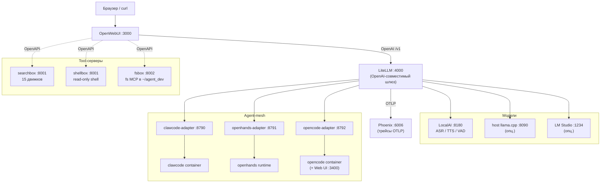

# lego-claw — собери свою изолированную среду общения с LLM-агентами

**lego-claw** — это набор «кубиков-лего» из готовых сервисов (OpenWebUI,
LiteLLM, LocalAI, agent-адаптеры, tool-серверы, Phoenix-наблюдаемость и др.),
которые поднимаются `docker compose`-стеками независимо. Концепция простая:

- Берёте только те «кубики», которые вам нужны — каждый `compose.*.yml`
  и `*-start.sh` самодостаточны.
- Всё работает **локально и изолированно** в одной docker-сети
  `llm-stack-net`: никаких внешних API-вызовов, если вы их сами не подключите.
- Единая точка входа в чате — **OpenWebUI** (`http://localhost:3000`).
  Под ним — единый OpenAI-совместимый шлюз **LiteLLM**, через который
  ходят и UI-чаты, и tool-серверы, и agent-mesh.
- Хотите свою модель — подключаете `llama.cpp` / LocalAI / LM Studio /
  vLLM / любой OpenAI-совместимый endpoint в `docker/litellm/config.yaml`.
- Хотите свой инструмент агенту — добавляете compose-файл, регистрируете
  в OpenWebUI через `scripts/openwebui-register-*.sh`.

> Этот проект — **публичный snapshot без секретов**. Все API-ключи,
> JWT-токены и приватные пути заменены placeholder'ами. Перед первым
> запуском нужно (1) скопировать `.env*.example` → `.env*`, (2) сгенерировать
> секреты, (3) запустить `bash stack-start.sh`. Подробности — ниже.

---

## Архитектура одной картинкой



Все сервисы общаются через единую docker-сеть `llm-stack-net` и
наружу выставляют только loopback-порты (`127.0.0.1:*`).

---

## Что внутри (по «кубикам»)

| Кубик | Compose / Launcher | Порт | За что отвечает |
| --- | --- | --- | --- |
| **OpenWebUI** | `compose.openwebui.yml` | :3000 | Главный чат-UI, регистрация tool-серверов, RBAC |
| **LiteLLM** | `compose.openwebui.yml` (включает litellm) | :4000 | OpenAI-шлюз для всех клиентов: модели, fallback'и, токен-учёт |
| **Phoenix** | `compose.phoenix.yml` | :6006 | OTLP-трейсы LiteLLM + аналитика стоимости |
| **LocalAI** | `compose.localai.yml` | :8180 | ASR / TTS / embeddings под GPU (опц.) |
| **SearXNG** | `compose.searxng.yml` | :8081 | Meta-поиск (поверх Google/DDG/Wikipedia/…) |
| **searchbox** | `compose.searchbox.yml` | :8001 | OpenWebUI-tool на 15 поисковых движков |
| **shellbox** | `compose.shellbox.yml` | :8001 | Read-only shell-tool с whitelist'ом команд |
| **fsbox** | `compose.fsbox.yml` | :8002 | RW-filesystem MCP в `$FSBOX_WORKSPACE_DIR` |
| **Claw Code** | `compose.clawcode.yml` + `clawcode-start.sh` | (exec only) | Rust-CLI агент в контейнере |
| **OpenHands** | `compose.openhands.yml` + `openhands-start.sh` | :3300 | Полноценный OpenHands GUI + spawned runtime sandbox |
| **opencode** | `compose.opencode.yml` + `opencode-start.sh` | :3400 (--web) | ACP-агент с Web UI |
| **agent-mesh** | `compose.agents-mesh.yml` | :8790-:8792 | HTTP-адаптеры, превращающие агентов в OpenAI-tool'ы |
| **agent-registry** | (часть mesh) | :8780 | Каталог доступных агентов с health-check |
| **skills-manager** | (часть mesh) | :8781 | Реестр инструкций / промптов, версионируемых |
| **Jupyter (host)** | `jupyter-host-start.sh` | 127.0.0.1:8888 | Code Interpreter для OpenWebUI, на хосте (не в Docker) |
| **MCP search** | `mcp/` | stdio / :8001 | Свой MCP-server (15 движков) — для Cursor/Claude Desktop |

Любой кубик можно поднять/остановить отдельно. `stack-start.sh` —
единая точка входа, поднимает «обязательный минимум» (Phoenix +
LiteLLM + OpenWebUI + tool-серверы).

---

## Что нужно установить

**Обязательно:**

- Linux x86_64 или ARM64 (тестировано на NVIDIA DGX Spark / GB10).
- Docker ≥ 24 + Docker Compose v2.
- Python ≥ 3.12 (только для host-side Jupyter и Sherpa-моста).
- ~700 MB на репо + по образам (десятки GB при первом `docker pull`).

**Желательно:**

- NVIDIA GPU + `nvidia-container-toolkit` (для LocalAI / llama.cpp / vLLM).
- LM Studio (если нужны GGUF-модели через LM Studio API :1234).

---

## Быстрый старт за 5 шагов

### 1. Скопировать шаблоны env-файлов

В репо лежат **только** публичные `.env*.example`-шаблоны
(`.env*` в `.gitignore`). Первое, что делаем:

```bash
cp .env.example          .env
cp .env.openwebui.example .env.openwebui
cp .env.opencode.example  .env.opencode
cp .env.openhands.example .env.openhands
cp .env.clawcode.example  .env.clawcode
cp .env.runtime.example   .env.runtime
cp .env.llamacpp.example  .env.llamacpp
```

### 2. Сгенерировать секреты

Все ключи в шаблонах — placeholder'ы вида
`__GENERATE_WITH_openssl_rand_hex_32__`. Сгенерировать сразу все:

```bash
# .env — adapter-ключи + agent-registry/skills-manager
for k in CLAWCODE_ADAPTER_API_KEY OPENHANDS_ADAPTER_API_KEY \
         OPENCODE_ADAPTER_API_KEY AGENT_REGISTRY_API_KEY \
         SKILLS_MANAGER_API_KEY; do
  sed -i "s|^$k=.*|$k=$(openssl rand -hex 32)|" .env
done

# .env.openwebui — секреты UI + tool-серверов + host-jupyter
for k in WEBUI_SECRET_KEY SEARXNG_SECRET JUPYTER_TOKEN \
         SHELLBOX_API_KEY FSBOX_API_KEY SEARCHBOX_API_KEY; do
  sed -i "s|^$k=.*|$k=$(openssl rand -hex 32)|" .env.openwebui
done
```

(При желании повторить для остальных `.env.*`, если они у вас содержат
секреты — но обычно в этих файлах только пути и порты.)

При первом входе в OpenWebUI назначьте админа через web-форму или
заранее задайте `OPENWEBUI_ADMIN_EMAIL` / `OPENWEBUI_ADMIN_PASSWORD`
в `.env.openwebui`.

### 3. Поднять основной стек

```bash
bash stack-start.sh
```

Что произойдёт:

1. Создастся docker-сеть `llm-stack-net`.
2. Поднимутся `phoenix-db` + `phoenix` + `litellm-db` + `litellm` +
   `openai-stack-relay`.
3. Поднимется `localai` (если на хосте есть GPU).
4. Поднимется `openwebui`.
5. Поднимутся `searxng`, `searchbox`, `shellbox`, `fsbox`.
6. **Если** оба `*_ADAPTER_API_KEY` заданы — поднимутся `clawcode-adapter`
   и `openhands-adapter` (`compose.agents-mesh.yml`).
7. Если есть `.venv-jupyter/`, запустится host-side Jupyter на :8888.

Скрипт идемпотентен — можно перезапускать сколько угодно.

### 4. Проверить, что всё ок

```bash
bash stack-smoke.sh
```

Запускает 12+ проверок (LiteLLM `/v1/models`, OpenWebUI signin,
audio loop, Phoenix `/health`, OpenHands `:3300/`).

### 5. Открыть UI

| Что | Где | Логин |
| --- | --- | --- |
| OpenWebUI | http://localhost:3000 | задайте при первом входе или через `OPENWEBUI_ADMIN_*` в `.env.openwebui` |
| LiteLLM Admin UI | http://localhost:4000/ui | `LITELLM_UI_USERNAME` / `LITELLM_UI_PASSWORD` из `.env` |
| Phoenix (трейсы) | http://localhost:6006 | без логина (только в `llm-stack-net`) |
| OpenHands UI | http://localhost:3300 | `bash openhands-start.sh` |
| opencode Web UI | http://localhost:3400 | `bash opencode-start.sh --web` |

---

## Опциональные «кубики»

```bash
bash openhands-start.sh             # OpenHands GUI :3300
bash clawcode-start.sh              # Claw Code (Rust CLI), интерактивный exec
bash opencode-start.sh              # opencode (idle TUI-container + ACP-bridge готов)
bash opencode-start.sh --web        # opencode container + web UI :3400 одной командой
bash opencode-web-start.sh          # опц. opencode web UI :3400 (если контейнер уже запущен)
bash llamacpp-host-start.sh         # host llama.cpp :8090 (если у вас GGUF-модель)
bash jupyter-host-start.sh          # host-side Jupyter (Code Interpreter)
```

Каждый launcher идемпотентен и проверяет наличие нужных переменных.

---

## Демо-сценарии (русские)

```bash
bash stack-demo-ru.sh                   # «расскажи стих про NVIDIA DGX»: ASR → LLM → TTS
bash agent-mesh-demo-ru.sh              # readiness agent-mesh без живых вызовов
bash agent-mesh-demo-ru.sh --run        # + один реальный POST /v1/run на clawcode-adapter
bash agent-mesh-demo-ru.sh --check-mcp  # cross-wiring MCP (Claw ↔ OpenHands)
bash clawcode-demo-ru.sh                # Claw Code: headless smoke
bash openhands-demo-ru.sh               # OpenHands: headless smoke
bash opencode-demo-ru.sh                # opencode: ACP-канал + version-check
```

Все demo-скрипты интерактивные: печатают `>>` на каждом шаге,
на ошибке не молчат.

---

## Безопасность: что обязательно заполнить перед запуском

В этом snapshot'е удалены **все** реальные секреты — на их месте стоят
placeholder'ы `__GENERATE_WITH_openssl_rand_hex_32__`. Перед первым
запуском заполните своими значениями:

| Секрет | Файл | Сгенерировать заново |
| --- | --- | --- |
| `CLAWCODE_ADAPTER_API_KEY` | [`.env`](.env) | `openssl rand -hex 32` |
| `OPENHANDS_ADAPTER_API_KEY` | [`.env`](.env) | `openssl rand -hex 32` |
| `OPENCODE_ADAPTER_API_KEY` | [`.env`](.env) | `openssl rand -hex 32` |
| `AGENT_REGISTRY_API_KEY` | [`.env`](.env) | `openssl rand -hex 32` |
| `SKILLS_MANAGER_API_KEY` | [`.env`](.env) | `openssl rand -hex 32` |
| `WEBUI_SECRET_KEY` | [`.env.openwebui`](.env.openwebui) | `openssl rand -hex 32` |
| `SEARXNG_SECRET` | [`.env.openwebui`](.env.openwebui) | `openssl rand -hex 32` |
| `JUPYTER_TOKEN` | [`.env.openwebui`](.env.openwebui) | `openssl rand -hex 32` |
| `SHELLBOX_API_KEY` | [`.env.openwebui`](.env.openwebui) | `openssl rand -hex 32` |
| `FSBOX_API_KEY` | [`.env.openwebui`](.env.openwebui) | `openssl rand -hex 32` |
| `SEARCHBOX_API_KEY` | [`.env.openwebui`](.env.openwebui) | `openssl rand -hex 32` |
| `OPENWEBUI_ADMIN_EMAIL`, `OPENWEBUI_ADMIN_PASSWORD` | [`.env.openwebui`](.env.openwebui) | поставьте свои |

Что **уже** почищено в этом snapshot'е:

- Все hex-секреты в `.env*` заменены placeholder'ами (см. таблицу выше).
- Все персональные пути (`/home/<user>/...`) заменены на `${HOME}/...`
  или `~/...` в коде, compose'ах, скриптах и документации.
- Runtime-каталоги (`data/backups/`, `data/diagnostics/`, `data/debug/`,
  `data/trajectories/`, `docker/jupyter/runtime/`) опустошены —
  внутри только `.gitkeep` или `README.md`.
- Docker volume'ы (LiteLLM Postgres, OpenWebUI, Phoenix, SearXNG)
  не входят в репо; при первом запуске создаются с нуля.
- LibreChat / Dify / final_description / NLP-артефакты (PNG, WAV)
  удалены целиком — концепция «лего» делает их не нужными.

Проверить, не остались ли в коде персональные данные:

```bash
bash scripts/audit-clean.sh
```

Скрипт ищет `/home/<user>`, оставшиеся hex-секреты в `.env*`, email-адреса,
runtime-данные. Возвращает exit code != 0 если что-то нашлось.

---

## Структура каталога

```
.
├── compose.*.yml         # docker-compose стеки (по одному на сервис)
├── .env*.example         # публичные шаблоны (.env*  — gitignored)
├── *-start.sh            # launcher-скрипты (идемпотентные)
├── *-stop.sh             # парные stop-скрипты
├── *-demo-ru.sh          # демо/smoke сценарии (русские)
├── docker/               # Dockerfile'ы и конфиги
│   ├── litellm/          # config.yaml LiteLLM (модели, fallback'и)
│   ├── opencode/         # ACP-bridge image
│   ├── openhands-adapter/ # HTTP-адаптер вокруг openhands runtime
│   ├── clawcode-adapter/  # HTTP-адаптер вокруг Claw Code
│   ├── agent-mesh-common/ # общий ACP / health-check код
│   ├── searchbox/         # 15-engine search server
│   ├── shellbox/          # whitelisted shell MCP
│   ├── fsbox/             # filesystem MCP
│   ├── llamacpp/          # host llama.cpp wrapper
│   └── jupyter/           # config for host-side Jupyter
├── docs/                 # документация
│   ├── architecture.md   # карта стека + Mermaid
│   ├── architecture.puml # компонентная схема (PUML)
│   ├── sequence.puml     # 4 sequence-сценария agent-mesh
│   ├── agent-mesh.md
│   ├── a2a-walkthrough.md
│   ├── clawcode.md
│   ├── opencode.md
│   ├── openhands.md
│   ├── openwebui.md
│   ├── openwebui-tools.md
│   ├── litellm-clients.md
│   ├── llama-cpp-host.md
│   └── sherpa-lmstudio.md
├── mcp/                  # multi-engine MCP search server (15 движков)
├── models/               # Sherpa-ONNX ASR-модель (опц., 318 MB)
├── scripts/              # host-side helper'ы + lib/env-expand.sh
└── data/                 # runtime: backups, debug, diagnostics, trajectories
                          # (содержимое в .gitignore)
```

---

## Куда смотреть, если что-то сломалось

| Симптом | Куда лезть |
| --- | --- |
| `bash stack-start.sh` падает на «llm-stack-net уже занят» | `docker network rm llm-stack-net && bash stack-start.sh` |
| LiteLLM не публикует модель | `docker logs litellm`; проверить `docker/litellm/config.yaml` |
| OpenWebUI не видит tool-сервер | `bash scripts/openwebui-register-{searchbox,shellbox,fsbox}.sh` |
| OpenWebUI не видит agent-mesh tool | `bash scripts/openwebui-register-agent-mesh.sh` |
| LiteLLM не видит `agent/clawcode` | `bash scripts/litellm-register-agent-mesh.sh` |
| OpenHands runtime-sandbox не стартует | См. [`docs/openhands.md`](docs/openhands.md) → «Troubleshooting» |
| Claw Code «не видит» LiteLLM | Проверить `OPENAI_API_BASE` в `compose.clawcode.yml`, `.env.clawcode` |
| Phoenix пустой / не появляются трейсы | Проверить `PHOENIX_COLLECTOR_ENDPOINT`, `success_callback: arize_phoenix` в `litellm` |
| Память на пределе / OOM | `bash scripts/memory-report.sh`; см. [`docs/diagnostics/phase-a-results.md`](docs/diagnostics/phase-a-results.md) |
| Кейсы с правами на `$HOME/agent_dev` (fsbox / openhands) | См. `openhands-start.sh` секция «Workspace ACL» |

---

## Как остановить

```bash
docker compose -f compose.openwebui.yml down
docker compose -f compose.searchbox.yml down
docker compose -f compose.shellbox.yml  down
docker compose -f compose.fsbox.yml     down
docker compose -f compose.searxng.yml   down
docker compose -f compose.localai.yml   down
docker compose -f compose.phoenix.yml   down
docker compose -f compose.agents-mesh.yml down
bash openhands-stop.sh        # OpenHands + sandbox-ы
bash clawcode-stop.sh         # Claw Code
bash opencode-stop.sh         # opencode (+ web UI)

# или одним махом, если ничего другого в этой сети нет:
docker compose -f compose.phoenix.yml -f compose.openwebui.yml \
               -f compose.searxng.yml -f compose.searchbox.yml \
               -f compose.shellbox.yml -f compose.fsbox.yml \
               -f compose.localai.yml -f compose.agents-mesh.yml \
               down
```

Volumes (`phoenix_pg`, `phoenix_data`, `litellm_pg`, `openwebui-data-volume`, …)
переживают `down`. Если нужно стереть всё начисто:

```bash
docker compose -f compose.phoenix.yml   down -v
docker compose -f compose.openwebui.yml down -v
# и т.д. для каждого compose
```

---

## Куда читать дальше

- [`docs/architecture.md`](docs/architecture.md) — общая архитектура,
  Mermaid-диаграммы, что было удалено в фазах уборки.
- [`docs/agent-mesh.md`](docs/agent-mesh.md) — agent-mesh (Claw + OpenHands
  + opencode как tool / A2A через LiteLLM).
- [`docs/a2a-walkthrough.md`](docs/a2a-walkthrough.md) — пошаговая проверка
  agent-mesh «глазами пользователя».
- [`docs/clawcode.md`](docs/clawcode.md) — Claw Code: запуск,
  supply-chain, MCP cross-wiring.
- [`docs/openhands.md`](docs/openhands.md) — OpenHands: spawned-runtime,
  MCP, host.docker.internal трюки.
- [`docs/opencode.md`](docs/opencode.md) — opencode: ACP-канал,
  Web UI, контейнерная архитектура.
- [`docs/litellm-clients.md`](docs/litellm-clients.md) — как три
  UI-клиента (OpenWebUI / OpenHands / Claw / opencode) ходят через
  единый LiteLLM.
- [`docs/openwebui-tools.md`](docs/openwebui-tools.md) — как
  регистрировать свои tool-серверы (searchbox, shellbox, fsbox,
  agent-mesh).
- [`mcp/README.md`](mcp/README.md) — собственный MCP-search (15 движков).
- [`docs/sherpa-lmstudio.md`](docs/sherpa-lmstudio.md) — host-side
  ASR + LM Studio (опц.).

---

## Лицензия

Этот snapshot объединяет компоненты под разными OSS-лицензиями
(Apache-2.0, MIT, GPL). Сами «склейки» (compose-файлы, launcher'ы,
адаптеры, документация в `docs/`) — публикуются под MIT. Подробнее
о лицензиях upstream-проектов — на их официальных сайтах.

Удачного запуска. Если что-то непонятно — лога много, и они подробные;
скорее всего, ответ уже есть в `docker logs <service>` или в
`docs/<service>.md`.
