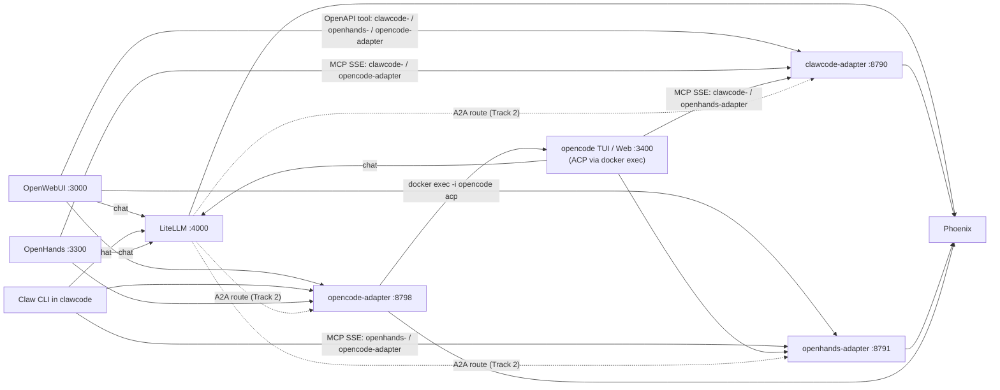

# Agent-mesh: каждый агент — tool, плюс Track 2 через LiteLLM A2A

Этот стек поднимает три headless-агента (Claw Code, OpenHands,
**opencode** — ACP-bridged) и показывает их друг другу и пользователю
как **обычные OpenAPI tool-servers + MCP SSE**. Документ описывает обе
дорожки:

- **Track 1 (основная)** — «agent as tool»: один LLM-вызов = одна задача
  через `POST /v1/run`. Видны как tool-серверы в OpenWebUI и как
  MCP-серверы для Claw / OpenHands / opencode.
- **Track 2 (контрольная)** — LiteLLM **A2A Agent Gateway** (beta в
  v1.83.x) с теми же тремя адаптерами в качестве A2A-таргетов и общим
  master key.

> Подробности opencode (отдельный standalone + ACP-bridge) —
> [`docs/opencode.md`](opencode.md).

Полный план (от которого происходят оба трека) —
[`plans/agent-mesh-tools-plus-a2a_*.plan.md`](../.cursor/plans/).

## Архитектура



## Файлы

| Артефакт | Назначение |
|---|---|
| [`compose.agents-mesh.yml`](../compose.agents-mesh.yml) | Поднимает `clawcode-adapter`, `openhands-adapter`, `opencode-adapter`, `agent-registry`, `skills-manager` на `llm-stack-net`. Loopback host-портами (8790/8791/8798 REST, 8796/8797/8799 gRPC, 8794 registry, 8795 skills-manager). |
| [`docker/clawcode-adapter/`](../docker/clawcode-adapter/) | FastAPI + MCP SSE адаптер, делегирует в Rust-CLI через `docker exec clawcode claw …`. |
| [`docker/openhands-adapter/`](../docker/openhands-adapter/) | FastAPI + MCP SSE адаптер, спавнит `openhands --headless` (свой ephemeral runtime-sandbox под каждый вызов). |
| [`docker/opencode-adapter/`](../docker/opencode-adapter/) | FastAPI + MCP SSE адаптер, поднимает long-lived `docker exec -i opencode opencode acp` (JSON-RPC stdio) и маппит `POST /v1/run` на ACP `session/new` + `session/prompt`. См. [`docs/opencode.md`](opencode.md). |
| [`docker/agent-mesh-common/agent_mesh_adapter.py`](../docker/agent-mesh-common/agent_mesh_adapter.py) | Общий FastAPI-фабрикатор: bearer-auth, `X-Agent-Mesh-Depth` cycle-guard, OTLP/Phoenix spans, MCP SSE через FastMCP. |
| [`docker/agent-mesh-common/a2a/`](../docker/agent-mesh-common/a2a/) | A2A-compliant binding'и: REST (`rest.py`), JSON-RPC (`jsonrpc.py`), gRPC (`grpc_server.py`); общие types/handlers; PushDispatcher (`push.py`); in-task auth (`auth.py`); JWS-подпись AgentCard (`jws.py`); proto vendor (`proto/a2a.proto`). |
| [`docker/agent-registry/`](../docker/agent-registry/) | Прокси/discovery-фронт перед всеми адаптерами для OpenWebUI. |
| [`docker/skills-manager/`](../docker/skills-manager/) | CRUD над `.ai/skills/`, broadcast `/admin/reload` после каждой записи. |
| [`scripts/openwebui-register-agent-mesh.sh`](../scripts/openwebui-register-agent-mesh.sh) | Регистрирует оба адаптера как tool-servers в OpenWebUI (идемпотентно). |
| [`scripts/openwebui-register-agent-registry.sh`](../scripts/openwebui-register-agent-registry.sh) | То же для `agent-registry` и `skills-manager`. |
| [`scripts/openwebui-ingest-a2a-spec.sh`](../scripts/openwebui-ingest-a2a-spec.sh) | Нарезает A2A спеку по разделам, загружает в OpenWebUI как knowledge `a2a-spec`. См. [`docs/a2a-rag.md`](a2a-rag.md). |
| [`scripts/litellm-register-agent-mesh.sh`](../scripts/litellm-register-agent-mesh.sh) | Регистрирует `agent/clawcode`, `agent/openhands` (и при наличии `OPENCODE_ADAPTER_API_KEY` — `agent/opencode`) в LiteLLM (DB) через `POST /model/new` — Track 2 без рестарта. |
| [`docker/litellm/config.yaml`](../docker/litellm/config.yaml) | Дублирующая git-source-of-truth запись (`agent/clawcode`, `agent/openhands`, `agent/opencode`) для случая чистой БД. |
| [`.ai/`](../.ai/) | Каталог скиллов (формат aitmpl / Claude Code). См. [`docs/skills.md`](skills.md). |

## Запуск

```bash
# 0) обязательные env (в .env):
#    CLAWCODE_ADAPTER_API_KEY=$(openssl rand -hex 32)
#    OPENHANDS_ADAPTER_API_KEY=$(openssl rand -hex 32)
#    OPENCODE_ADAPTER_API_KEY=$(openssl rand -hex 32)
#    LITELLM_API_KEY=... (уже было)

bash stack-start.sh                     # phoenix + litellm + ... + (auto)
                                        # если все ADAPTER_API_KEY заданы,
                                        # stack-start.sh поднимет и адаптеры
                                        # из compose.agents-mesh.yml сам.

# Ручной запуск, если AGENT_MESH_ENABLED=0:
docker compose --env-file .env -f compose.agents-mesh.yml up -d

# Track 1 — зарегистрировать в OpenWebUI (если data-volume уже существовал):
bash scripts/openwebui-register-agent-mesh.sh

# Track 2 — зарегистрировать в LiteLLM (если БД ещё не подхватила yaml):
bash scripts/litellm-register-agent-mesh.sh

# (опционально) Headless: бок-о-бок поднять Claw, OpenHands UI и opencode TUI:
bash clawcode-start.sh --no-attach
bash openhands-start.sh
bash opencode-start.sh --no-attach
bash opencode-web-start.sh              # опц. opencode web UI на :3400
```

## Как проверить, что всё работает (демо)

Главный артефакт — [`agent-mesh-demo-ru.sh`](../agent-mesh-demo-ru.sh) в корне
репо (по аналогии с `clawcode-demo-ru.sh`, `openhands-demo-ru.sh`,
`stack-demo-ru.sh`). Он покрывает оба трека и cycle-guard.

> Полная пошаговая инструкция для живой проверки в браузере + расширенный
> раздел про трассировку — [`docs/a2a-walkthrough.md`](a2a-walkthrough.md).
> Там же — четыре сценария (OpenWebUI как диспетчер, OpenWebUI как A2A-клиент,
> Claw → OpenHands и OpenHands → Claw через MCP) с командами и чек-листом.

```bash
bash agent-mesh-demo-ru.sh                    # readiness без живых вызовов
bash agent-mesh-demo-ru.sh --check-mcp        # + статика MCP_SERVERS из .env.*
bash agent-mesh-demo-ru.sh --run              # + живой POST /v1/run (Claw)
                                              #   и chat через agent/clawcode
bash agent-mesh-demo-ru.sh --run --openhands  # + реальный OpenHands run
                                              #   (~3 ГБ runtime-sandbox, ~30 s)
bash agent-mesh-demo-ru.sh --run --opencode   # + реальный opencode run
                                              #   (ACP session через адаптер)
bash opencode-demo-ru.sh --adapter            # отдельный smoke только для opencode
```

Что он печатает по шагам:

| Шаг | Что проверяет | Что значит «зелёный» |
|---|---|---|
| 0. Окружение | Docker daemon, сеть `llm-stack-net`, что заданы оба `*_ADAPTER_API_KEY` в `.env`. | Стек поднят и адаптеры могут стартовать. |
| 1. Адаптеры | `GET /healthz`, `GET /openapi.json` (с bearer), `POST /v1/run` с `X-Agent-Mesh-Depth=MAX` → 429. | `compose.agents-mesh.yml` запущен, bearer-токены валидны, cycle-guard работает. |
| 2. LiteLLM A2A | `GET /v1/models` содержит `agent/clawcode` и `agent/openhands`. | Track 2 виден клиентам OpenWebUI / Claw / OpenHands. |
| 3. Cross-wiring (`--check-mcp`) | Парсит `CLAWCODE_MCP_SERVERS` и `OPENHANDS_MCP_SERVERS` и проверяет, что Claw НЕ видит `clawcode-adapter`, OpenHands НЕ видит `openhands-adapter`. | Cycle-guard на уровне конфигурации. |
| 4. Live Track 1 (`--run`) | Один реальный `POST /v1/run` на `clawcode-adapter` и `chat.completions` модели `agent/clawcode`. | End-to-end: LLM-клиент → адаптер → Claw → ответ. |
| 5. Live Track 2 (`--run`) | То же через `agent/clawcode` (модель в LiteLLM). | LiteLLM-проксирование живо. |
| 6. Live OpenHands (`--run --openhands`) | `POST /v1/run` на `openhands-adapter` (спавнит runtime-sandbox). | Тяжёлый путь работает. По умолчанию пропускается. |

В конце выводится **чек-лист для живого браузерного демо**: четыре сценария
(OpenWebUI как диспетчер с tool-ами, OpenWebUI как прямой A2A-клиент,
Claw REPL зовёт OpenHands, OpenHands UI зовёт Claw) и ссылка на Phoenix.

### Куда смотреть, если что-то красное

| Симптом | Что проверить |
|---|---|
| `clawcode-adapter /healthz не отвечает` | `docker compose --env-file .env -f compose.agents-mesh.yml ps`, потом `docker logs clawcode-adapter`. Чаще всего: пустые `*_ADAPTER_API_KEY` в `.env` (compose использует `${VAR:?}` и просто не стартует). |
| `LiteLLM /v1/models не содержит agent/clawcode` | Либо БД LiteLLM пустая (свежий volume) — выполните `bash scripts/litellm-register-agent-mesh.sh`. Либо проверьте, что `docker/litellm/config.yaml` содержит секцию `agent/clawcode`. |
| `cycle-guard вернул HTTP 200` (а должен 429) | Проверьте `MAX_NESTED_AGENT_CALLS` в `.env`; адаптер увидел depth ниже лимита. Перезапустите адаптер после правки. |
| `Claw видит свой адаптер` (--check-mcp) | Уберите `clawcode-adapter` из `CLAWCODE_MCP_SERVERS` в `.env.clawcode`. Аналогично для OpenHands. |
| OpenWebUI не показывает tool-сервер | `bash scripts/openwebui-register-agent-mesh.sh` (требует `OPENWEBUI_VALIDATE_EMAIL/PASSWORD` или `OPENWEBUI_ADMIN_*` в `.env.openwebui`). Затем в чате: `➕ → toggle clawcode-adapter / openhands-adapter`. |

### Полный smoke

[`stack-smoke.sh`](../stack-smoke.sh) (раздел «D. agent-mesh adapters»)
делает то же самое, но в составе общей проверки стека. Удобно гонять перед
коммитом.

## HTTP-контракт адаптеров

Одинаков для Claw и OpenHands. Bearer-auth по
`CLAWCODE_ADAPTER_API_KEY` / `OPENHANDS_ADAPTER_API_KEY` соответственно.

### Legacy «agent-as-tool» surface

| Метод / путь | Назначение |
|---|---|
| `POST /v1/run` | One-shot: `{ "task": "...", "workspace_subdir": "...", "timeout_s": 600 }` → `{ "ok": ..., "result_text": "...", "files_changed": [...], "logs_tail": "...", "exit_code": ..., "duration_s": ..., "depth": 1 }`. **Deprecated**: новые клиенты должны звать `POST /a2a/v1/message:send` (Section 11) или JSON-RPC `message/send`. |
| `POST /v1/sessions` | Создать persistent-сессию (Phase 2). |
| `POST /v1/sessions/{id}/messages` | Послать следующее сообщение в существующую сессию. |
| `GET /v1/sessions/{id}` | Прочитать метаданные сессии. |
| `GET /openapi.json` | Для регистрации tool-server'а в OpenWebUI. |
| `GET /sse`, `POST /messages/` | MCP SSE транспорт (через FastMCP). |
| `GET /healthz` | Без auth, для compose-healthcheck. |

### A2A-совместимый surface (Section 4 / 9 / 10 / 11)

Адаптер монтирует три binding'а параллельно — все три бьют в одни и те
же handler'ы из `docker/agent-mesh-common/a2a/handlers.py`, так что
поведение совпадает байт-в-байт:

| Binding | URL / порт | Источник в коде |
|---|---|---|
| REST (Section 11) | `http://<adapter>:<port>/a2a/v1/*` | [`docker/agent-mesh-common/a2a/rest.py`](../docker/agent-mesh-common/a2a/rest.py) |
| JSON-RPC 2.0 (Section 9) | `POST http://<adapter>:<port>/a2a/jsonrpc` (`text/event-stream` для `message/stream` / `tasks/resubscribe`) | [`docker/agent-mesh-common/a2a/jsonrpc.py`](../docker/agent-mesh-common/a2a/jsonrpc.py) |
| gRPC (Section 10) | `<adapter-host>:<A2A_GRPC_PORT>` (loopback `:8796` / `:8797`) | [`docker/agent-mesh-common/a2a/grpc_server.py`](../docker/agent-mesh-common/a2a/grpc_server.py) (+ [`a2a.proto`](../docker/agent-mesh-common/a2a/proto/a2a.proto)) |

Поддерживаемые методы (одинаковые для всех трёх binding'ов):

| A2A метод (JSON-RPC name) | REST | gRPC | Назначение |
|---|---|---|---|
| `message/send` | `POST /a2a/v1/message:send` | `A2AService.SendMessage` | Создать Task; если `returnImmediately=false`, ждать терминального состояния. |
| `message/stream` | `POST /a2a/v1/message:stream` (SSE) | `A2AService.StreamMessage` | Создать Task + стрим status/artifact событий. |
| `tasks/get` | `GET /a2a/v1/tasks/{id}` | `A2AService.GetTask` | Снимок Task'а; поддерживает `historyLength`/`includeArtifacts`. |
| `tasks/list` | `GET /a2a/v1/tasks?contextId=…&pageSize=…&pageToken=…&status=…` | `A2AService.ListTasks` | Cursor-based pagination (Section 3.1.4). |
| `tasks/cancel` | `POST /a2a/v1/tasks/{id}:cancel` | `A2AService.CancelTask` | Перевод в `TASK_STATE_CANCELED`; 409 если уже terminal. |
| `tasks/resubscribe` | `POST /a2a/v1/tasks/{id}:subscribe` (SSE) | `A2AService.ResubscribeToTask` | Подключиться к существующему стриму. |
| `tasks/pushNotificationConfig/set` | `POST /a2a/v1/tasks/{id}/pushNotificationConfigs` | `A2AService.SetPushNotificationConfig` | Зарегистрировать webhook (см. ниже). |
| `tasks/pushNotificationConfig/list/get/delete` | `GET/DELETE /a2a/v1/tasks/{id}/pushNotificationConfigs[/{cfgId}]` | соответствующие RPC | CRUD над webhook'ами. |
| `agent/getCard` | `GET /.well-known/agent-card.json` (без auth, JWS-подпись) и `GET /a2a/v1/extendedAgentCard` (с auth) | `A2AService.GetAgentCard` | Section 5 — discovery. |

`POST /tasks/{id}/auth:provide` и `GET /tasks/{id}/auth:challenge` —
не-стандартный (но spec-aligned) транспорт для in-task auth
(`TASK_STATE_AUTH_REQUIRED`, Section 7.6). Подробности — в
[«In-task auth»](#in-task-auth).

### Push notifications (Section 7.5)

Webhook'и зарегистрированные через
`POST /a2a/v1/tasks/{id}/pushNotificationConfigs` доставляются
`PushDispatcher`'ом
([`docker/agent-mesh-common/a2a/push.py`](../docker/agent-mesh-common/a2a/push.py))
с экспоненциальным backoff'ом (`A2A_PUSH_MAX_RETRIES=5`,
`A2A_PUSH_BACKOFF_BASE_S=1.0`). Каждый POST несёт заголовок
`X-A2A-Notification-Token: <cfg.token>` (Section 7.5.1) — приёмник
должен вызывать `validate_notification_token` перед обработкой.

### In-task auth

Когда runner упирается в нехватку creds, он зовёт
`request_auth(task_id, AuthChallenge(...))` из
[`docker/agent-mesh-common/a2a/auth.py`](../docker/agent-mesh-common/a2a/auth.py):
Task переходит в `TASK_STATE_AUTH_REQUIRED`, в `status.message.metadata.authChallenge`
лежит payload (schemes, scopes, optional `credentialsUrl`).
Клиент любым удобным транспортом подтягивает creds и POST'ит
`{taskId}/auth:provide` с `{scheme, value, challengeId}`. Task снова
становится `TASK_STATE_WORKING`, runner получает creds в виде
`AuthCredentials` и продолжает.

Сессия выживает дисконнект: клиент может пропустить событие в SSE
стриме и догнать через `GET /tasks/{id}` или
`POST /tasks/{id}:subscribe`.

⚠ Phase 2 (sessions) сейчас реализован через **«recap»-стратегию**: каждый
вызов `/messages` пересылает агенту накопленную историю как один большой
prompt. Это упрощает реализацию, но проигрывает по эффективности
истинному streaming-REPL. Полная история живёт в памяти адаптера и
теряется при рестарте — если нужна persistance, расширьте
`SessionStore` в `agent_mesh_adapter.py`.

## Cycle-guard

Каждый адаптер пишет принятый `X-Agent-Mesh-Depth` (default 0) +1 и
рефьюзит 429, если результат превышает `MAX_NESTED_AGENT_CALLS` (default
1 в [`.env`](../.env)). Все три tool-описания (OpenWebUI registration,
MCP tool, OpenAPI summary) явно говорят LLM:

> Use ONLY when the task is outside your own capabilities — never call
> yourself (cycle guard, `max_nested_agent_calls=1`).

Self-loop ещё запрещён конфигурационно:

| Агент | Видит как MCP-сервер | НЕ видит |
|---|---|---|
| Claw Code (`compose.clawcode.yml`) | `searchbox`, `openhands-adapter`, `opencode-adapter` (через compose-DNS) | свой `clawcode-adapter` |
| OpenHands (`compose.openhands.yml`) | `searchbox`, `clawcode-adapter`, `opencode-adapter` (через `host.docker.internal:<loopback>`) | свой `openhands-adapter` |
| opencode (`compose.opencode.yml`) | `searchbox`, `clawcode-adapter`, `openhands-adapter` (через compose-DNS) | свой `opencode-adapter` |

Конкретные JSON-списки — `.env.clawcode → CLAWCODE_MCP_SERVERS`,
`.env.openhands → OPENHANDS_MCP_SERVERS` и
`.env.opencode → OPENCODE_MCP_SERVERS`.

## Phoenix-наблюдаемость

Адаптеры пишут OTLP/HTTP spans в Phoenix
(`OTEL_EXPORTER_OTLP_ENDPOINT=http://phoenix:6006/v1/traces`,
`PHOENIX_PROJECT_NAME=qwen3.6-heretic` — тот же проект, что у LiteLLM
success/failure callback в [`docker/litellm/config.yaml`](../docker/litellm/config.yaml)).
В одном trace-view видны:

- LLM-запросы клиента (через LiteLLM callback);
- адаптерный span `agent_mesh.run.<agent_id>` или
  `agent_mesh.sessions.message.<agent_id>`;
- если включён Track 2, LiteLLM-запрос на `agent/clawcode`
  автоматически захватывает оба span'а в одну трейс-цепочку.

## Track 2: LiteLLM A2A (beta)

LiteLLM v1.83.7-stable экспонирует **A2A Agent Gateway** как
beta-эндпоинты (см. [docs.litellm.ai/docs/a2a](https://docs.litellm.ai/docs/a2a)).
В этом репо мы используем простейший вариант — два proxy-алиаса в
`docker/litellm/config.yaml` (`agent/clawcode`, `agent/openhands`),
указывающих на адаптеры по compose-DNS:

```yaml
- model_name: "agent/clawcode"
  litellm_params:
    model: "openai/clawcode-adapter"
    api_base: "http://clawcode-adapter:8790/v1"
    api_key: "os.environ/CLAWCODE_ADAPTER_API_KEY"
```

Это даёт две вещи:

1. Любой LLM-клиент LiteLLM (OpenWebUI / Claw / OpenHands) может звать
   эти алиасы как обычную «модель» через `/v1/chat/completions` — LiteLLM
   проксирует на адаптер, адаптер исполняет `POST /v1/run`.
2. Если на образе LiteLLM включить полноценный A2A-агент-роутер
   (через Admin UI → A2A → Add Target), эти же два URL подходят как
   A2A-таргеты с тем же bearer.

### Переключение Track 1 ↔ Track 2

- Track 1 (OpenWebUI tool-server, MCP cross-wiring) включён по умолчанию,
  пока заданы оба `*_ADAPTER_API_KEY`.
- Track 2 (LiteLLM как роутер) включается на стороне клиента — достаточно
  выбрать модель `agent/clawcode` / `agent/openhands` в чате OpenWebUI
  или указать её в API-вызове LiteLLM. **Никакого рестарта** ни OpenWebUI,
  ни самих агентов не требуется.

### Где регистрируются записи

Образ `ghcr.io/berriai/litellm-database:v1.83.7-stable` с
`STORE_MODEL_IN_DB=True`: записи живут в Postgres-БД `litellm-db`. Два
эквивалентных пути:

| Где | Когда |
|---|---|
| Admin UI (http://localhost:4000/ui) | Быстрый итеративный путь; не требует рестарта. |
| `docker/litellm/config.yaml` | Source-of-truth для git; подхватывается при рестарте. |

Скрипт [`scripts/litellm-register-agent-mesh.sh`](../scripts/litellm-register-agent-mesh.sh)
дёргает `POST /model/new` напрямую — те же записи, без UI-кликов.

## Риски и открытые вопросы

- **Claw non-interactive flag** — `claw --output-format json prompt "<task>"`
  (`docker/clawcode-adapter/server.py`); если апстрим переименует
  `prompt` подкоманду в новых релизах, адаптер сломается. Пин
  `CLAWCODE_GIT_REF` в [`.env.clawcode`](../.env.clawcode) даёт
  предсказуемость.
- **OpenHands headless cold start** — каждый `/v1/run` спавнит свежий
  runtime-sandbox (~2-3 GB образ, ~30 s до первого ответа). Адаптер
  держит `OPENHANDS_ADAPTER_CONCURRENCY=1` и таймаут
  `OPENHANDS_ADAPTER_TIMEOUT=1800` — больше двух параллельных задач
  лучше не запускать на dev-машине.
- **A2A beta** — эндпоинты помечены unstable, и формат А2А-агентов
  может поменяться между минорами LiteLLM. Track 1 (адаптеры как
  tool-server) не зависит от этого формата и продолжит работать.
- **`docker.sock` в адаптерах** — RW (для `docker exec` / `docker run`).
  Тот же компромисс, что у OpenHands GUI. Адаптеры держим без публичного
  host-port'а; mitigations — bearer auth + cycle guard + loopback only.
- **Runtime-sandbox vs DNS** — OpenHands runtime-sandbox смотрит на
  default bridge и не видит compose-DNS `clawcode-adapter`. Поэтому
  `OPENHANDS_MCP_SERVERS` в [`.env.openhands`](../.env.openhands)
  указывает на `http://host.docker.internal:<CLAWCODE_ADAPTER_HOST_PORT>/sse`
  (loopback публикуется compose-файлом).
- **Recap-стратегия в sessions** — каждый turn пересылает всю историю.
  Для длинных диалогов это дорого по токенам. Допустимо в Phase 2;
  улучшение требует доступа к стабильному REPL upstream'а.

## Smoke-проверка

```bash
# Health checks
curl -fsS http://127.0.0.1:8790/healthz
curl -fsS http://127.0.0.1:8791/healthz

# One-shot run через Track 1 (адаптер напрямую)
curl -fsS -X POST http://127.0.0.1:8790/v1/run \
    -H "Authorization: Bearer $CLAWCODE_ADAPTER_API_KEY" \
    -H "Content-Type: application/json" \
    -d '{"task":"Echo hello world","timeout_s":120}'

# То же через Track 2 (LiteLLM A2A)
curl -fsS -X POST http://localhost:4000/v1/chat/completions \
    -H "Authorization: Bearer $LITELLM_API_KEY" \
    -H "Content-Type: application/json" \
    -d '{"model":"agent/clawcode","messages":[{"role":"user","content":"Echo hello world"}]}'

# Cycle-guard
curl -i -X POST http://127.0.0.1:8790/v1/run \
    -H "Authorization: Bearer $CLAWCODE_ADAPTER_API_KEY" \
    -H "X-Agent-Mesh-Depth: 1" \
    -H "Content-Type: application/json" \
    -d '{"task":"test"}'
# → HTTP 429, X-Agent-Mesh-Depth: 2 в ответе.
```

Spans видны в Phoenix UI (http://localhost:6006) под проектом
`qwen3.6-heretic` (или другим, если меняли `PHOENIX_PROJECT_NAME`).
