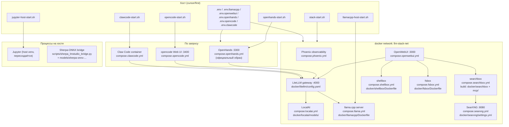
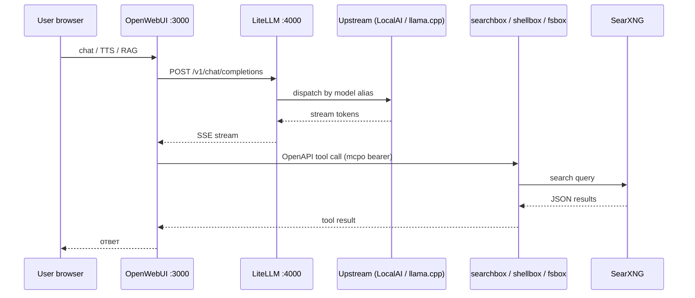

# Архитектура стека `cursor/first` после уборки

Этот документ описывает, что осталось в репозитории `${HOME}/lego-claw`
после очистки от вендоренных upstream-исходников и пересоздаваемых virtualenv'ов
(см. `docs/cleanup-cursor-first-stack` план), какую роль играет каждый компонент
и как данные ходят через систему.

Связанный артефакт: `docs/architecture.puml` (PlantUML-вариант той же схемы).

---

## Карта репозитория (что оставлено / что удалено)

| Путь | Размер | Назначение | Решение |
| --- | --- | --- | --- |
| `compose.*.yml` (10 файлов) | ~30 KB | Docker Compose стеков (llama, localai, openwebui, searxng, searchbox, shellbox, fsbox, phoenix, openhands, …) | **Keep** |
| `.env`, `.env.llamacpp`, `.env.openhands`, `.env.openwebui`, `.env.runtime` | ~28 KB | env-файлы для compose / launcher-скриптов | **Keep** |
| `stack-start.sh`, `stack-smoke.sh`, `stack-demo-ru.sh` | ~58 KB | Главный bootstrap + smoke-тесты | **Keep** |
| `openhands-start.sh`, `openhands-stop.sh`, `openhands-demo-ru.sh`, `opencode-start.sh`, `opencode-stop.sh`, `opencode-web-start.sh`, `localai-start.sh`, `localai-qwen36-start.sh`, `llamacpp-host-start.sh`, `jupyter-host-start.sh` | ~50 KB | Точечные launcher-скрипты | **Keep** |
| `docker/` | 136 KB | Dockerfiles + конфиги (`fsbox`, `jupyter`, `litellm`, `llamacpp`, `localai`, `searchbox`, `searxng`, `shellbox`) | **Keep** |
| `mcp/` | ~352 KB (без `__pycache__`) | Исходники MCP search-сервера (15 движков), подтягиваются в образ `searchbox` | **Keep** |
| `models/sherpa-onnx-zipformer-ru-2024-09-18` | 318 MB | ASR-модель для Sherpa-ONNX (см. `docs/sherpa-lmstudio.md`) | **Keep** |
| `scripts/` | 48 KB | Регистрация tool servers OpenWebUI, sherpa-bridge | **Keep** |
| `docs/` | 104 KB | Документация (`architecture.puml`, `agent-mesh.md`, `openhands.md`, …) | **Keep** |
| `instructions/qwen3.6-35b-heretic.yaml` | 8 KB | Инструкции для модели | **Keep** |
| `data/backups`, `data/debug`, `data/trajectories` | 7.5 MB | Runtime-артефакты (gitignored) | **Keep** |
| `nginx/` (логи) | runtime | Bind-mount target | **Keep** |
| `configs/` | пустой | Bind-mount target для `configs/voices.ru.json` и `configs/prompts/system.txt` | **Keep** (пустой каталог нужен для bind-mount) |
| `docs/diagnostics/phase-a-results.md` | 4 KB | Сводка benchmark-фазы A | **Keep** (перенесено из `diagnostics/phase-a/`) |
| `dify/` | 390 MB | Полный клон upstream Dify | **Removed**: ни один `compose.*.yml` / `*.sh` не запускает Dify |
| `openhands/` | 35 MB | Полный клон upstream OpenHands | **Removed**: `compose.openhands.yml` тянет официальный образ `docker.openhands.dev/openhands/openhands:1.6` |
| `.local/` | 745 MB | Cross-build артефакты (`go`, `qemu-user`, `ubuntu-amd64-root`, `x86_64-sysroot`, `amd64-debs-cache`) | **Removed**: ни один `.sh` / compose / Dockerfile не ссылается |
| `.venv/` | 135 MB | Python venv (хост) | **Removed**: пересоздаётся скриптами |
| `.venv-jupyter/` | 512 MB | venv для `jupyter-host-start.sh` | **Removed**: воссоздаётся самим скриптом |
| `.venv-sherpa/` | 108 MB | venv для sherpa-bridge | **Removed**: воссоздаётся `scripts/sherpa-lmstudio` |
| `.pytest_cache/` | 32 KB | Кеш pytest | **Removed** |
| `mcp/**/__pycache__/` | мелочь | Python bytecode cache | **Removed** |
| `nginx.conf/` | пустой | Stray-каталог с точкой в имени, нет ссылок | **Removed** |
| `librechat/` (целиком: compose + конфиг + 277 MB MongoDB-чатов + Meili) | ~362 MB | LibreChat был вторым UI рядом с OpenWebUI | **Removed**: концепция «лего» сводит UI к одному OpenWebUI; кому нужен LibreChat — добавляет свой `compose.librechat.yml` |
| `diagnostics/phase-a/A*.log` | 132 KB | Сырые логи benchmark-фазы | **Removed**: сводка осталась в `docs/diagnostics/phase-a-results.md` |

**Итого освобождено:** около **2.46 GB**.

---

## Архитектура стека (после уборки)

---

## Поток данных пользователя через OpenWebUI

---

## Воссоздание удалённого

| Удалили | Как вернуть при необходимости |
| --- | --- |
| `.venv/`, `.venv-jupyter/`, `.venv-sherpa/` | Запустить соответствующий `*-start.sh` (скрипты идемпотентно создают venv заново) |
| `mcp/**/__pycache__/` | Появятся автоматически при первом импорте Python-модулей |
| `librechat/` (UI + 277 MB MongoDB-чатов) | Концепция «лего» свела UI к одному OpenWebUI. Кому нужен LibreChat — берёт upstream `git clone https://github.com/danny-avila/LibreChat librechat` и пишет свой `compose.librechat.yml` |
| `openhands/` upstream-исходники | Не нужны: `compose.openhands.yml` тянет `docker.openhands.dev/openhands/openhands:1.6` |
| `dify/` | Не использовался ни одним compose / launcher; чтобы вернуть Dify — `git clone https://github.com/langgenius/dify.git dify` |
| `.local/` (cross-build артефакты) | Артефакты экспериментов; не упомянуты ни в одном Dockerfile / `*.sh` |
| `diagnostics/phase-a/A*.log` | Свежий бенчмарк можно перезапустить (см. `docs/llama-cpp-host.md`); сводка фазы — `docs/diagnostics/phase-a-results.md` |
