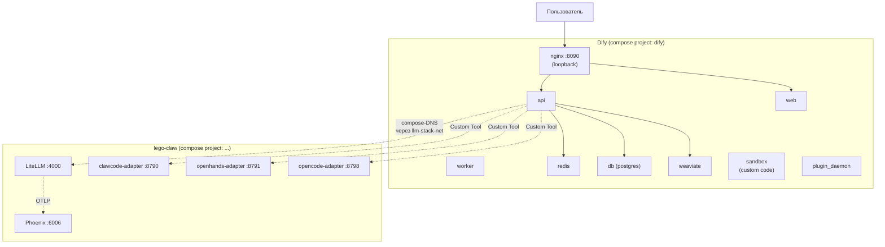
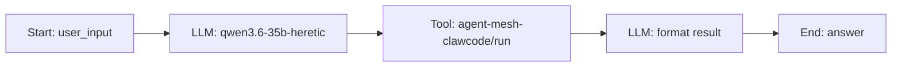

# Dify (visual workflow builder) как опциональный кубик

[Dify](https://github.com/langgenius/dify) — open-source no-code платформа
для сборки LLM-приложений (chatbots, agent workflows, RAG-пайплайны).
В `lego-claw` он включён как **опциональный** кубик: даёт визуальный
конструктор поверх **нашей** локальной LiteLLM и agent-mesh адаптеров,
не пытаясь заменить ни OpenWebUI, ни OpenHands.

Версия: **`langgenius/dify-api:1.13.3`** (vendored — `dify/docker/`).
Снапшот upstream: <https://github.com/langgenius/dify/tree/1.13.3/docker>.

---

## Зачем включён в стек

| Кому | Что даёт |
| --- | --- |
| Не-программистам | Drag-and-drop сборка workflow'ов: «LLM-нода → tool → if/else → end». Без кода. |
| Прототипировщикам | Быстрая проверка идей: подключить новый OpenAPI tool за 30 секунд. |
| Командам | Шаринг workflow'ов через DSL-экспорт (`.yml`), импорт коллегой одним кликом. |
| Dev-Ops | Все секреты в собственном `dify/docker/.env`, отдельный compose-проект (`docker compose -p dify down`). |

---

## Архитектура: как Dify видит наш стек



Dify api/worker подключаются к нашей сети `llm-stack-net` через
[`compose.dify.yml`](../compose.dify.yml). Это позволяет резолвить
compose-DNS-имена напрямую (`http://litellm:4000`, `http://clawcode-adapter:8790`)
без выставления адаптеров наружу.

---

## Файловая раскладка

```
dify/
└── docker/                # vendored upstream (git-tracked)
    ├── docker-compose.yaml             # 1640 строк, упреем
    ├── docker-compose.middleware.yaml  # альтернативный «отдельная БД»
    ├── .env.example                    # все 700+ env переменных Dify
    ├── middleware.env.example
    ├── nginx/
    │   ├── conf.d/default.conf.template
    │   ├── nginx.conf.template
    │   ├── proxy.conf.template
    │   ├── https.conf.template
    │   ├── docker-entrypoint.sh
    │   └── ssl/.gitkeep
    ├── ssrf_proxy/
    │   ├── squid.conf.template
    │   └── docker-entrypoint.sh
    ├── volumes/           # runtime данные (git-ignored)
    └── .env               # пользовательский, заполняется dify-start.sh (git-ignored)

compose.dify.yml          # наш override: порт + сеть + extra_hosts
.env.dify.example         # наш конфиг для register-скриптов
dify-start.sh
dify-stop.sh
scripts/
├── dify-register-litellm.sh        # LiteLLM как provider
└── dify-register-agent-mesh.sh     # 3 адаптера как Custom Tools
examples/
└── dify-workflow-agent-mesh.yml    # пример DSL для импорта
```

---

## ACP / A2A интеграция

«ACP» (Agent Communication Protocol) и «A2A» (Agent-to-Agent) в нашем
стеке — это HTTP-адаптеры
[`compose.agents-mesh.yml`](../compose.agents-mesh.yml), которые отдают
OpenAPI-описание (`/openapi.json`) и совместимы с OpenAI tool-call
интерфейсом. Dify умеет потреблять любой OpenAPI 3.x → значит наши
адаптеры подключаются как полноценные Custom Tools.

После `bash scripts/dify-register-agent-mesh.sh`:

| Tool в Dify Studio | Что делает | OpenAPI URL | Auth |
| --- | --- | --- | --- |
| `agent-mesh-clawcode` | one-shot Claw Code (Rust CLI) headless | `http://clawcode-adapter:8790/openapi.json` | Bearer `$CLAWCODE_ADAPTER_API_KEY` |
| `agent-mesh-openhands` | one-shot OpenHands 1.6 + ephemeral runtime | `http://openhands-adapter:8791/openapi.json` | Bearer `$OPENHANDS_ADAPTER_API_KEY` |
| `agent-mesh-opencode` | one-shot opencode (ACP-bridged) | `http://opencode-adapter:8798/openapi.json` | Bearer `$OPENCODE_ADAPTER_API_KEY` |

Эти URL **резолвятся изнутри Dify api-контейнера** через сеть
`llm-stack-net`. С хоста они доступны как
`http://localhost:8790/8791/8798` (loopback).

### Workflow «Local LLM делегирует Claw Code»

[`examples/dify-workflow-agent-mesh.yml`](../examples/dify-workflow-agent-mesh.yml)
— готовый DSL для импорта:



Studio → Create from DSL → Import → выберите файл.

---

## Кастомизация

### Добавить свой OpenAPI tool

Dify Studio → Tools → Custom → Create Custom Tool:

- **Schema**: paste OpenAPI 3.x YAML / JSON, либо «From URL» — для нашего
  паттерна `http://<svc>:<port>/openapi.json`.
- **Authorization**: API Key (Bearer), header `Authorization`.
- **Privacy / Disclaimer**: краткое описание, что tool делает.

Сохранили → перетащили в любой workflow.

### Поменять модель

В любой LLM-node Studio → выбираем provider `OpenAI-API-compatible`
(или ваш кастом) → выбираем `qwen3.6-35b-heretic` (или другой алиас
из `docker/litellm/config.yaml`).

Чтобы зарегистрировать НОВЫЙ алиас в Dify:

```bash
DIFY_LITELLM_DEFAULT_MODEL=phi4-local bash scripts/dify-register-litellm.sh
```

### Поменять промпт / параметры

Прямо в Studio. Изменения сохраняются в Dify-БД (Postgres-volume
`dify/docker/volumes/db/`). При экспорте DSL они попадают в YAML.

---

## Troubleshooting

### `docker-sandbox-1` рестартится в крайслупе

Sandbox требует write-доступ к `/dev/shm` и Linux capabilities
`SYS_PTRACE`. На GB10/aarch64 без правок upstream — работает; если
запускаете под подсистемой с `--cap-drop=ALL`, добавьте обратно
`SYS_PTRACE` или отключите в Dify settings → System → «Code execution».

### `docker-plugin_daemon-1` exit (1)

`plugin_daemon` хранит plugins в `dify/docker/volumes/plugin_daemon/`.
Если volume повреждён (например после `docker volume prune`) — снесите:

```bash
bash dify-stop.sh --purge      # стирает ВСЕ данные Dify, включая чаты
```

### Миграции БД не применились (api в exited (1))

Logs:
```bash
docker logs docker-api-1 --tail 80
```

Лекарство: остановить api/worker, поднять snapshot DB вручную, пересоздать:
```bash
docker compose -p dify -f dify/docker/docker-compose.yaml -f compose.dify.yml \
    up -d --force-recreate api worker worker_beat
```

### LLM-node «Connection refused» к LiteLLM

Проверить, что Dify api в нашей сети:

```bash
docker network inspect llm-stack-net | grep -i docker-api
# Должно показать строку с docker-api-1
```

Если нет — `bash dify-stop.sh && bash dify-start.sh` (compose.dify.yml
прокидывает Dify api в `llm-stack-net`).

### Custom Tool: «Failed to fetch OpenAPI»

При регистрации через UI Dify пытается скачать `/openapi.json` ИЗ
api-контейнера, а не с хоста. Если Dify api ещё не в `llm-stack-net`
— получите 502. Проверьте сначала: `docker exec docker-api-1 wget -qO- http://clawcode-adapter:8790/openapi.json | head -5`.

### Console token: где взять / что делать если потерял

UI: Settings → Profile → API Keys → Create new. Сохраните в
`.env.dify`. Если потеряли — старый отзовите в том же UI и сгенерируйте
новый.

### Конфликт порта 8090 с host llama.cpp

Оба сервиса по умолчанию слушают `:8090`. При одновременном запуске
выберите:

- `DIFY_HOST_PORT=8095` в `.env.dify` (Dify nginx переедет на :8095), **или**
- `LLAMA_CPP_HOST_PORT=8091` в `.env.llamacpp` + перезапустить
  `llamacpp-host-start.sh`.

---

## Где смотреть upstream-документацию

- Главное README: <https://github.com/langgenius/dify/blob/1.13.3/README.md>
- Compose docs: <https://github.com/langgenius/dify/blob/1.13.3/docker/README.md>
- DSL reference: <https://docs.dify.ai/guides/workflow/dsl>
- Console API (auth, model providers, tools): не задокументирована,
  но эндпоинты можно подсмотреть в `dify/api/controllers/console/...`
  кода upstream.
