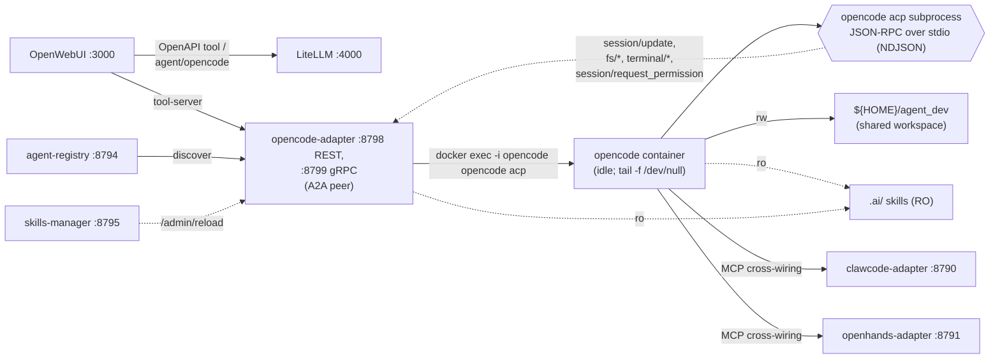

# opencode (ACP-bridged)

[opencode](https://opencode.ai/) — terminal-native coding agent (TUI +
optional HTTP web UI) с **встроенным ACP-bridge'ем** (`opencode acp`):
JSON-RPC 2.0 поверх NDJSON-stdio. Поэтому интеграция в наш agent-mesh
радикально отличается от Claw / OpenHands: адаптер не парсит stdout
CLI, а ведёт двусторонний JSON-RPC через `docker exec -i opencode opencode acp`.

> **⚠ Supply-chain.** opencode ставится через `curl | bash` инсталлятор
> с opencode.ai. Перед merge зафиксируйте `OPENCODE_VERSION` (тег/SHA)
> в `.env.opencode`. Контейнер запускается **без** `docker.sock`, под
> отдельным UID 10102 и не выставляет порт наружу (за исключением
> опционального `opencode web` UI на :3400 → `4096`).

Подготовленные артефакты:

- [`docker/opencode/Dockerfile`](../docker/opencode/Dockerfile) —
  `node:22-bookworm-slim` + установка opencode + предустановленные LSP
  (pyright, typescript-language-server, bash-language-server) +
  опц. rust-analyzer/gopls через build-arg `OPENCODE_EXTRA_LSP=rust,go`.
- [`docker/opencode/opencode.json`](../docker/opencode/opencode.json) —
  шаблон конфига: `litellm` как OpenAI-совместимый provider, default
  model `litellm/qwen3.6-35b-heretic`.
- [`compose.opencode.yml`](../compose.opencode.yml) — отдельный compose в
  сети `llm-stack-net`. Контейнер «спит» (`tail -f /dev/null`); все
  входы — через `docker exec`.
- [`docker/opencode-adapter/`](../docker/opencode-adapter/) — FastAPI +
  MCP SSE адаптер: `acp_client.py` (async NDJSON JSON-RPC поверх
  `docker exec -i`), `terminals.py` (terminal/* реализация), `server.py`
  (`OpencodeRunner.run_one_shot` маппит на ACP `session/new` +
  `session/prompt`).
- [`.env.opencode`](../.env.opencode) — тумблеры (image, version, default
  model, workspace, state, LiteLLM URL/key, UID/GID, web port, MCP).
- [`opencode-start.sh`](../opencode-start.sh) /
  [`opencode-stop.sh`](../opencode-stop.sh) — launcher и stopper
  (зеркало `clawcode-start.sh`).
- [`opencode-web-start.sh`](../opencode-web-start.sh) — опц. Web UI на
  `127.0.0.1:${OPENCODE_WEB_HOST_PORT:-3400}` → внутри `:4096`.
- [`opencode-demo-ru.sh`](../opencode-demo-ru.sh) — headless smoke
  + ACP-smoke (initialize/session/new) + опц. `--adapter` для прогона
  `POST /v1/run` через adapter.
- [`.ai/skills/opencode-workflow/SKILL.md`](../.ai/skills/opencode-workflow/SKILL.md) —
  bootstrap-скилл для opencode (LSP, terminals, cycle-guard).

## Архитектура



**Outside-in:** каждый `POST /v1/run` (или
`POST /a2a/v1/message:send`) на адаптер становится одной ACP-сессией:
`initialize` (один раз при старте) → `session/new` (cwd =
`/workspace/project[/<subdir>]`) → `session/prompt` → стрим
`session/update`-нотификаций → терминальный ответ с `stopReason`.

**Inside-out:** opencode сам вызывает на адаптере
`fs/read_text_file`, `fs/write_text_file`, `terminal/create`,
`session/request_permission` — адаптер обслуживает их как ACP-Client.

## Запуск

```bash
bash stack-start.sh                # обычный стек (litellm + openwebui + …)
bash opencode-start.sh             # build (если нужно) + start + TUI
bash opencode-start.sh --no-attach # поднять контейнер + web UI :3400 (TUI пропускается)
bash opencode-start.sh --web       # alias --no-attach (legacy)
bash opencode-start.sh --no-web    # ТОЛЬКО контейнер: ни TUI, ни web (CI / agent-mesh)
bash opencode-web-start.sh         # отдельно поднять web UI :3400 (если контейнер уже жив)
bash opencode-demo-ru.sh           # readiness + ACP smoke
bash opencode-demo-ru.sh --adapter # + POST /v1/run через opencode-adapter
bash opencode-stop.sh              # остановить только opencode
```

> **Семантика флагов в [opencode-start.sh](../opencode-start.sh)**:
> начиная с этой версии `--no-attach` означает «контейнер + web UI без
> TUI» — это самый частый сценарий. `--web` сохранён как alias.
> Старое поведение (только контейнер, без UI вообще, нужно для
> `agent-mesh` и CI) теперь требует явного `--no-web`.

`opencode-start.sh` сам выставляет POSIX-ACL на
`$OPENCODE_WORKSPACE_DIR` (`${HOME}/agent_dev` по умолчанию) под
uid `10102`, аналогично тому, как `clawcode-start.sh` делает это для
uid `10101`.

## Связь с LiteLLM

Конфиг `[docker/opencode/opencode.json](../docker/opencode/opencode.json)`
объявляет `litellm` как OpenAI-совместимого provider'а через
`@ai-sdk/openai-compatible`. opencode читает значение из
`${env:LITELLM_API_KEY}` — переменная пробрасывается через
compose.opencode.yml.

Для **opencode** имя модели — это `<provider>/<model>` строка из его
конфига (например `litellm/qwen3.6-35b-heretic`), которая отображается
в LiteLLM-алиас `qwen3.6-35b-heretic` (или `openai/qwen3.6-35b-heretic`).

## MCP cross-wiring

Через `OPENCODE_MCP_SERVERS` opencode получает JSON-список MCP
серверов. По умолчанию это **`searchbox`, `clawcode-adapter`,
`openhands-adapter`** (зеркало политики Claw / OpenHands). opencode
**не видит** собственного `opencode-adapter` — самоделегирование
запрещено и в конфиге, и в адаптере (`X-Agent-Mesh-Depth ≥
MAX_NESTED_AGENT_CALLS` → HTTP 429).

```
OPENCODE_MCP_SERVERS=[{"name":"searchbox","type":"sse","url":"http://searchbox:8090/sse"},{"name":"clawcode-adapter","type":"sse","url":"http://clawcode-adapter:8790/sse"},{"name":"openhands-adapter","type":"sse","url":"http://openhands-adapter:8791/sse"}]
```

## opencode как tool через opencode-adapter

Помимо TUI/Web, opencode публикуется агент-мешу через адаптер
[`docker/opencode-adapter/`](../docker/opencode-adapter/), который
поднимается из [`compose.agents-mesh.yml`](../compose.agents-mesh.yml).
Адаптер делает `docker exec -i opencode opencode acp` (long-lived
JSON-RPC поверх stdio) и возвращает ответ как обычный FastAPI/MCP-SSE
контракт. Снаружи opencode виден как:

- **OpenAPI tool-server** в OpenWebUI (`http://opencode-adapter:8798`);
- **MCP SSE сервер** для Claw / OpenHands (`http://opencode-adapter:8798/sse`);
- **LiteLLM-alias** `agent/opencode` (Track 2).

## Permissions policy

opencode шлёт `session/request_permission` Client'у (нам) перед каждой
sensitive операцией. Адаптер отвечает по политике из
`OPENCODE_ADAPTER_AUTO_APPROVE`:

| Значение | Семантика |
|---|---|
| `workspace` (default) | approve, если все пути в `toolCall` лежат внутри `/workspace/project`. Любая попытка выйти → `cancelled` + WARN в логи. |
| `all` | approve всё. Использовать только в trusted-демо. |
| `none` | deny всё. Полезно для compliance-аудитов. |
| `ask` | deny всё (headless-режим, нет интерактивного UI). |

## Workspace и права доступа

Дефолтный `OPENCODE_WORKSPACE_DIR` совпадает с Claw/OpenHands — это
тот же sandbox, который уже используют `fsbox` и host-side Jupyter.
Внутри контейнера он смонтирован в `/workspace/project`.

Контейнер бежит под uid `10102` (на единицу больше Claw — `10101`).
На ext4 для этого работают POSIX-ACL, которые `opencode-start.sh`
накатывает автоматически:

```bash
RUNTIME_UID=10102
sudo setfacl -R  -m u:$RUNTIME_UID:rwx,g:$RUNTIME_UID:rwx ${HOME}/agent_dev
sudo setfacl -R -dm u:$RUNTIME_UID:rwx,g:$RUNTIME_UID:rwx,u:1000:rwx,g:1000:rwx \
                 ${HOME}/agent_dev
```

## LSP в образе

Минимальный набор (всегда в образе, ~120 MB):
* **pyright** — Python
* **typescript-language-server** + `typescript` — TS/JS
* **bash-language-server** — Bash

Опц. через build-arg `OPENCODE_EXTRA_LSP=rust,go`:
* **rust-analyzer** — prebuilt бинарник из GitHub Releases (multi-arch).
* **gopls** — `go install`.

```bash
# .env.opencode
OPENCODE_EXTRA_LSP=rust,go
```

После правки — `bash opencode-start.sh --no-attach` (compose сам
пересоберёт образ; build-кеш обнулится только для LSP-stage).

## Troubleshooting

| Симптом | Что проверить |
|---|---|
| `opencode acp` не запускается | `docker exec opencode opencode --help \| grep acp` — на старых версиях команда называлась иначе. Зафиксируйте `OPENCODE_VERSION` в `.env.opencode`. |
| `permission_denied` на путях вне workspace | `OPENCODE_ADAPTER_AUTO_APPROVE` ограничивает запись `/workspace/project`. Расширьте политику осознанно (`all` только в trusted-демо). |
| `docker exec` рвёт stdio при перезапуске контейнера | Адаптер ловит `ProcessLookupError`/`BrokenPipeError` и поднимает ACP-сессию заново — это уже в `acp_client.AcpClient.ensure_initialized()`. Если ошибка повторяется, проверьте `docker logs opencode`. |
| opencode не находит `opencode.json` | Mount-маска `docker/opencode/opencode.json:/home/opencode/.config/opencode/opencode.json:ro` — проверьте, что файл существует на хосте и git его не игнорирует. |
| Web UI на `:3400` 404 | `opencode web` запущен? Проверьте `bash opencode-web-start.sh` (логи в `/.opencode/web.log` внутри контейнера). |
| Cycle-guard сработал ошибочно (HTTP 429) | `MAX_NESTED_AGENT_CALLS` в `.env` — поднимите, если осознанно нужно нестинг ≥ 2. |

## opencode vs Claw vs OpenHands

| | OpenHands | Claw Code | opencode |
|---|---|---|---|
| compose-файл | `compose.openhands.yml` | `compose.clawcode.yml` | `compose.opencode.yml` |
| launcher | `openhands-start.sh` | `clawcode-start.sh` | `opencode-start.sh` |
| образ | `openhands:1.6` + runtime sandbox | `voice-assistant-clawcode:local` | `voice-assistant-opencode:local` |
| docker.sock | да | **нет** | **нет** |
| nested-runtime | да (ephemeral) | нет | нет |
| GUI | http://localhost:3300 | CLI only | TUI + опц. Web UI на :3400 |
| Headless контракт | `openhands --headless --json` | `claw --output-format json prompt` | **ACP** (`opencode acp`, JSON-RPC stdio) |
| Адаптер делает | `docker run` runtime-sandbox | `docker exec claw …` | `docker exec -i opencode acp` (long-lived) |
| workspace | `${HOME}/agent_dev` | то же | то же |
| state | `~/.openhands` | `~/.clawcode` | `~/.opencode` |
| uid | 10001 | 10101 | 10102 |
| Концепция «session» | внутренние conversation_id | recap-стратегия | **нативные** ACP-сессии |

Каждый из трёх агентов **независим** — можно держать все три запущенными
параллельно, они пользуются одним LiteLLM и одним sandbox-каталогом.

## См. также

- [`docs/agent-mesh.md`](agent-mesh.md) — общая архитектура mesh'а.
- [`docs/skills.md`](skills.md) — как написать ещё один скилл для opencode.
- [`docs/a2a-walkthrough.md`](a2a-walkthrough.md) — пошаговый live-сценарий.
- [`opencode.ai/docs/acp`](https://opencode.ai/docs/acp/) — upstream-докиACP-bridge'а.
- [`agentclientprotocol.com`](https://agentclientprotocol.com/) — спека ACP.
